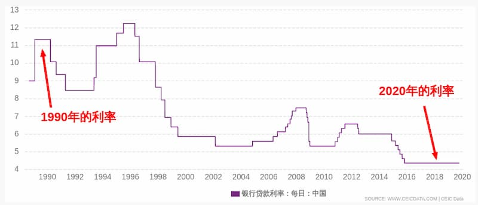

一直以来，升学的问题一直萦绕在我的心头。

### 研究生扩招
这个月，[教育部公布](http://edu.people.com.cn/n1/2020/0302/c1053-31612535.html)了2020年研究生招生规模，今年比去年增加18.9万人，同比增长20%。按照国家统计局日前公布的《2019年国民经济和社会发展统计公报》，2019年全年研究生教育招生91.7万人。就此推算，扩招之后，今年的研究生招生规模或将达110万人。

类别|招生|在校|毕业
-|-|-|-
研究生|91.7|2864|64.0
普通本专科|914.9|3031.5|758.5
中等职业教育|600.4|1576.5|493.4
普通高中|839.5|2414.3|789.2
初中生|1638.8|4827.1|1454.1
普通小学|1869.0|10561.2|1647.9

这是为了落实国务院的要求，因为今年有疫情，高校毕业生的就业形势非常严峻，扩大研究生招生，可以减少就业压力。

这固然是不得已的措施，但也反映了我们国家的现实：`高等教育的目的，并不完全是培养学术人才，很大程度上充当了就业缓冲层。`

一旦就业不好，高校就会扩招。由于一再的扩招，研究生的培养质量下滑得很厉害。

这些年已经司空见惯了，博士研究生去参加公务员考试、去应聘中小学教师。几乎任何一个有学历要求的招聘岗位，都有博士生在应聘。学历贬值的程度可见一斑。

在我看来，读研越来越不值得，研究生文凭在贬值，而学到的那些知识完全可以在互联网上自学。一边工作一边学习，会比读研的成本小很多。工作中提高技能，了解社会，更重要的是可以有收入；下班后，再通过网络自学，补充知识，思考自己未来要走的方向。总之，中国的研究生教育不是出路，学到的东西太少，浪费的时间太多。

### 基准利率降低

美国最近将基准利率降[到了0%](https://finance.sina.com.cn/money/bond/market/2020-03-26/doc-iimxyqwa3220083.shtml)。我觉得，大家对这件事不太关注，觉得跟自己没关系，或者觉得这是临时措施。

事实恰恰相反。我觉得，这是最重要的几个长期经济迹象之一，对每个人都会产生影响，而且比疫情本身的影响更深远持久。

它说明了一件事，高利率的时代已经永远地结束了。 美国的利率降到了零，中国的利率也在不断下降，欧洲甚至在去年就已经是负利率了。这绝不是暂时的，我们将会长期面对低利率。

利率是资金的成本。利率低就说明资金便宜，你可以用非常低的价格借到钱。反过来，它也反映了社会的平均利润率。如果各种项目的利润率很高，而利率又很低，就会有更多的人去借钱，从而促使利率回升。

`利率一降再降，恰恰说明了社会的平均利润率在不断下降。` 通俗地说，就是可以赚钱的好项目，越来越难找了。

下面就是这件事对每个人的影响：`高回报项目的消失、利率的下降、经济增长的放缓，使得你很难有办法攒钱了。` 你好不容易积攒了一点工资，却发现根本找不到高回报的投资途径，不管是银行存款、证券投资、项目投资，回报率都很低。

由于投资回报很低，大部分人的财富只能主要依靠工资积累，一有大的消费，或者生活变故，那点钱顿时就会化为乌有。所以对于年轻人来说，想要生活自立，就必须尽早开始工作，获取工资。越晚工作，经济处境就会越困难，因为你找不到快速积累资金的方法，年龄在增长，但是资产却增长很慢。

应不应该读研？我认为，如果等到24岁才研究生毕业，去就业市场找人生第一份工作，就真的有点太晚了。至少在读研期间，就要想办法去挣钱。

以上的观点引自阮一峰的文章，读到结尾，他都在说明升学前后的事情，但面对是否升学问题时没有表否定的说法，升学固然是无疑的！

我还认为，考虑到个人和社会竞争力，我们90后亟需追求`固定资产和量化指标`。

- [1] [研究生扩招](http://www.ruanyifeng.com/blog/2020/03/weekly-issue-99.html)

- [2] [基准利率降低](http://www.ruanyifeng.com/blog/2020/03/weekly-issue-100.html)