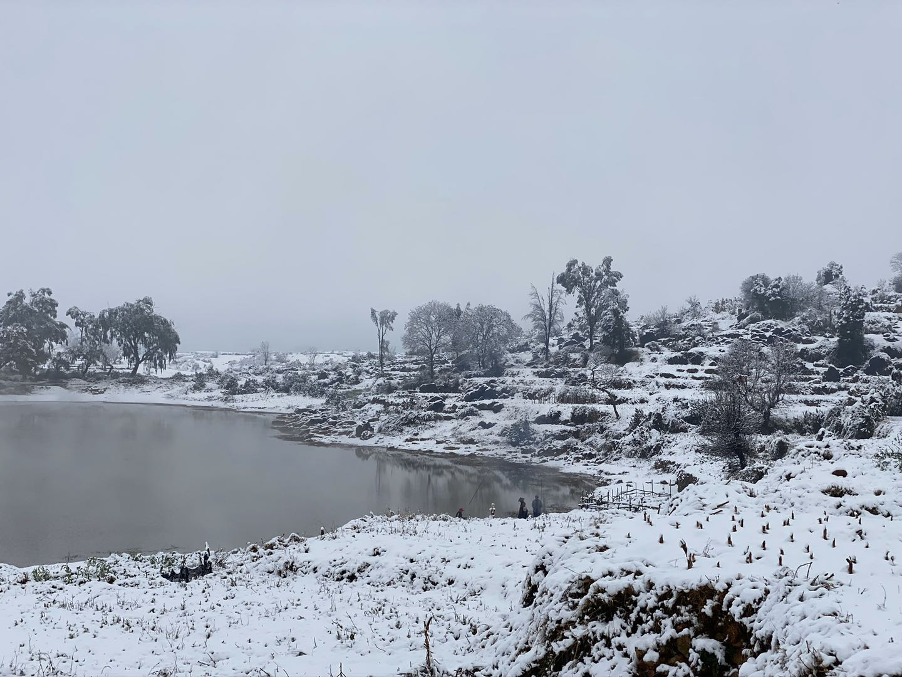
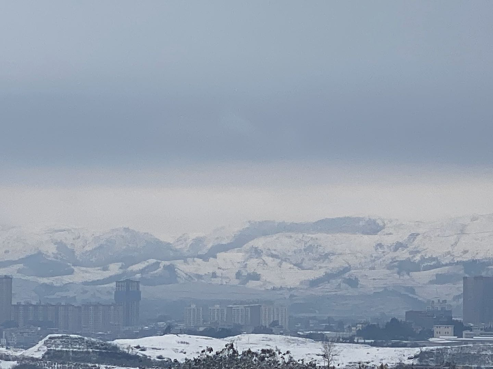

今天是元宵节，伴随着它的到来假期也快结束了。

今年，新型冠状病毒在武汉爆发，让很多人因此失去了宝贵的生命，多少医务工作者也因此在新春佳节失去与家人团聚的机会而不得不夜以继日的和病毒作斗争。

就在我们这儿清净、祥和的小村庄里，也下起了多年未见得雪花，它比任何一年都下的那么大，雪花漫天飞舞，堆成厚厚外层。

从家里冲出去，没想到在河边有人在钓鱼，旁边搂起篝火，虽在雪地里，但倍感温暖。

我怀着好奇冲动的心情在雪地里跋涉，在高地拍下了雪中的县城。

